---
## Front matter
title: "Отчет по лабораторной работе 5"
author: "Дмитрий Дмитриевич Ерин"

## Generic otions
lang: ru-RU

## Bibliography
bibliography: bib/cite.bib
csl: pandoc/csl/gost-r-7-0-5-2008-numeric.csl

## Pdf output format
toc: true # Table of contents
toc-depth: 2
lof: true # List of figures
lot: true # List of tables
fontsize: 12pt
linestretch: 1.5
papersize: a4
documentclass: scrreprt
## I18n polyglossia
polyglossia-lang:
  name: russian
  options:
	- spelling=modern
	- babelshorthands=true
polyglossia-otherlangs:
  name: english
## I18n babel
babel-lang: russian
babel-otherlangs: english
## Fonts
mainfont: PT Serif
romanfont: PT Serif
sansfont: PT Sans
monofont: PT Mono
mainfontoptions: Ligatures=TeX
romanfontoptions: Ligatures=TeX
sansfontoptions: Ligatures=TeX,Scale=MatchLowercase
monofontoptions: Scale=MatchLowercase,Scale=0.9
## Biblatex
biblatex: true
biblio-style: "gost-numeric"
biblatexoptions:
  - parentracker=true
  - backend=biber
  - hyperref=auto
  - language=auto
  - autolang=other*
  - citestyle=gost-numeric
## Pandoc-crossref LaTeX customization
figureTitle: "Рис."
tableTitle: "Таблица"
listingTitle: "Листинг"
lofTitle: "Список иллюстраций"
lotTitle: "Список таблиц"
lolTitle: "Листинги"
## Misc options
indent: true
header-includes:
  - \usepackage{indentfirst}
  - \usepackage{float} # keep figures where there are in the text
  - \floatplacement{figure}{H} # keep figures where there are in the text
---

# Цель работы

Приобретение практических навыков работы в Midnight Commander. Освоение
инструкций языка ассемблера mov и int.

# Задания

1. Создайте копию файла lab6-1.asm. Внесите изменения в программу (без
использования внешнего файла in_out.asm), так чтобы она работала по
следующему алгоритму:
• вывести приглашение типа “Введите строку:”;
• ввести строку с клавиатуры;
• вывести введённую строку на экран.

2. Получите исполняемый файл и проверьте его работу. На приглашение
ввести строку введите свою фамилию.

3. Создайте копию файла lab6-2.asm. Исправьте текст программы с исполь-
зование подпрограмм из внешнего файла in_out.asm, так чтобы она ра-
ботала по следующему алгоритму:
• вывести приглашение типа “Введите строку:”;
• ввести строку с клавиатуры;
• вывести введённую строку на экран

4. Создайте исполняемый файл и проверьте его работу.

# Выполнение лабораторной работы

1. Открываю midnight commander

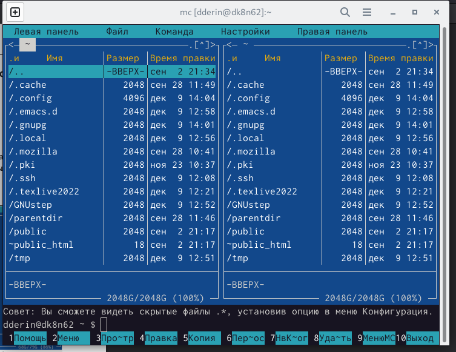{ #fig:001 width=70% }

2. Перехожу в каталог arch-pc

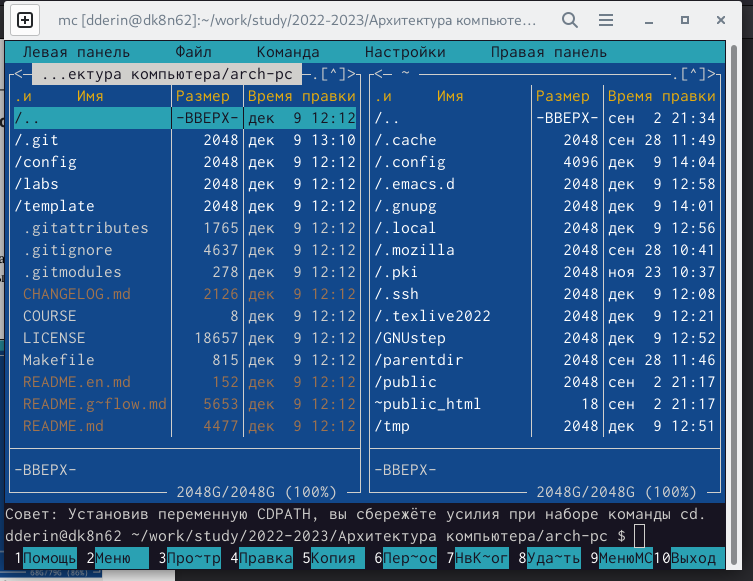{ #fig:002 width=70% }

3. Создаю каталог lab06 и перехожу в него

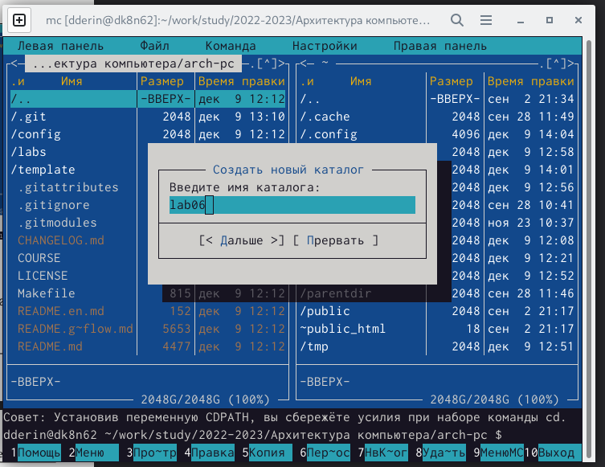{ #fig:003 width=70% }

4. Создаю файл lab06-1.asm с помощь команды touch

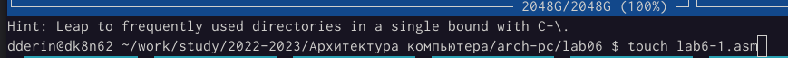{ #fig:004 width=70% }

5. С помощью клавиши f4 открываю файл lab06-1.asm для редактирования, ввожу данный текст и сохраняю

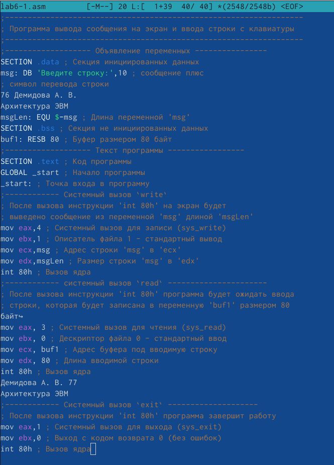{ #fig:005 width=70% }

6. С помощью f3 проверяю правильность сохранения файла

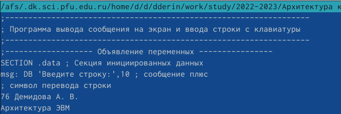{ #fig:006 width=70% }

7. Транслирую текст программы lab6-1.asm в объектный файл. Выполняю компоновку объектного файла и запускаю получившийся исполняемый файл. Программа выводит строку 'Введите строку:' и ожидает ввода с клавиатуры. На запрос ввожу ФИО.

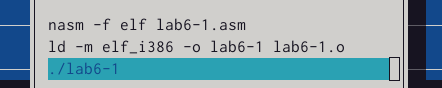{ #fig:008 width=70% }
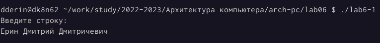{ #fig:007 width=70% }

8. Скачиваю файл .asm и переношу в каталог lab6

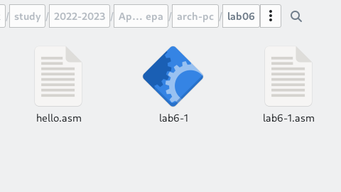{ #fig:009 width=70% }

9. Создаю копию файла lab6-1.asm с названием lab6-2.asm

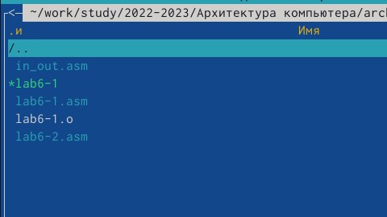{ #fig:010 width=70% }

10. Изменяю код программы lab6-2.asm на данный в лаборатоной работе

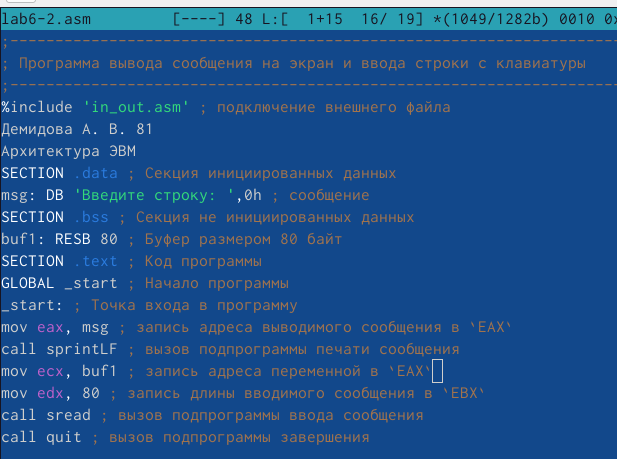{ #fig:011 width=70% }

11. Изменяю sprintLF на sprint в lab6-2.asm и запускаю код

{ #fig:011 width=70% }
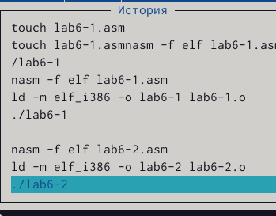{ #fig:012 width=70% }
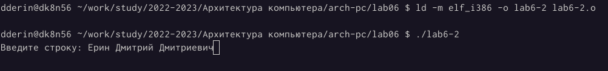{ #fig:013 width=70% }

Код вводимой строки отображается в ней же, а не на строку ниже

# Вывод

Я приобрел практические навыки работы в Midnight Commander и освоил инструкции языка ассемблера mov и int.

